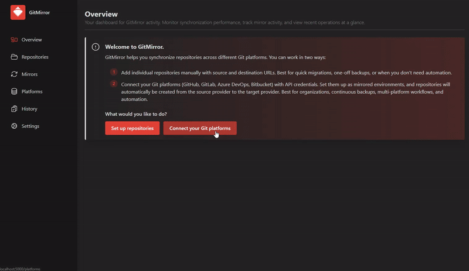

# GitMirror

[](https://github.com/DanielMigchels/GitMirror/actions/workflows/build.yml) [](https://hub.docker.com/r/danielmigchels/gitmirror)

A repository mirroring service that automatically synchronizes Git repositories across multiple Git platforms.



## What Does GitMirror Do?

GitMirror automatically mirrors Git repositories from source platforms to target platforms with scheduled synchronization. The service:
- **Discovers repositories** from configured source platforms
- **Creates mirror repositories** automatically on target platforms if they don't exist
- **Synchronizes changes** to keep repositories up-to-date
- **Maintains history** of all synchronization operations
- **Provides a web UI** for managing platforms, repositories, and mirror configurations

All synchronization tasks run on a schedule, ensuring your mirror repositories stay current with minimal manual intervention.

## Why GitMirror?

GitMirror was created when I discovered that pull mirroring was locked behind GitLab EE Premium. This project does not only mirror repositories but also automatically creates projects on the target Git provider if they don't exist.

## Supported Git Platforms
The code is proven to work for Azure DevOps -> GitLab. All other integrations are WIP.
- **Azure DevOps**
- **GitLab**
- **GitHub**
- **Bitbucket**

## How to Run

Instructions on how to run the application.

### Docker Compose
Compiles source code, builds docker image, and runs it along with its dependencies on your docker instance.

```bash
docker-compose up
```
App becomes available on port 5000 and should be reachable through HTTP. (http://localhost:5000)

### Helm Chart
Installs the app on your Kubernetes cluster.

```bash
helm install gitmirror .\GitMirror.Helm\ --namespace gitmirror --create-namespace
```
App becomes available on port 32111 and should be reachable through HTTP. (http://localhost:32111)

## Future Improvements

- **Horizontally Scalable Architecture**: Separate Hangfire job processing from the API to enable horizontal scaling of the API layer. Currently, Hangfire is embedded in the API, which limits scalability.
- **Enhanced Platform Support**: Complete and stabilize GitHub and Bitbucket integrations
- **Webhook Support**: Enable real-time syncing triggered by repository changes